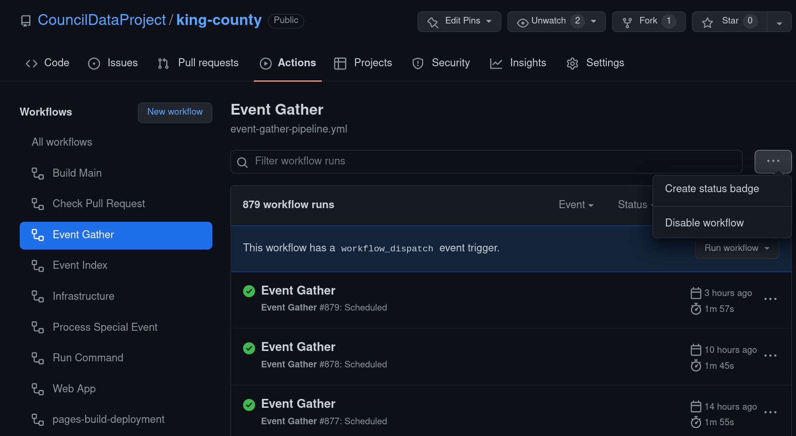
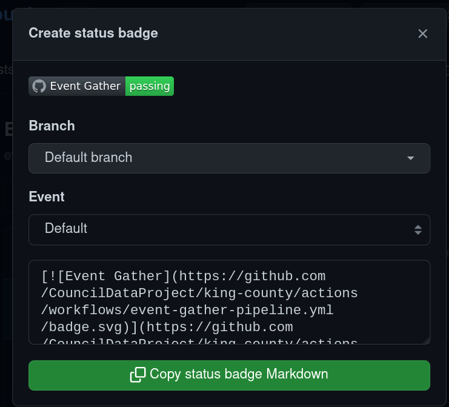

# Contributing

To add a new instance to this README:

1. Go to: https://github.com/CouncilDataProject/{MUNICIPALITY-SLUG}/actions/workflows/event-gather-pipeline.yml with the `{MUNICIPALITY-SLUG}` filled in (i.e. king-county or seattle)
2. Click the `...` button in the top right
   
3. Click the "Copy status badge Markdown" button and paste it in to a new row in the table with the instance primary name
   
